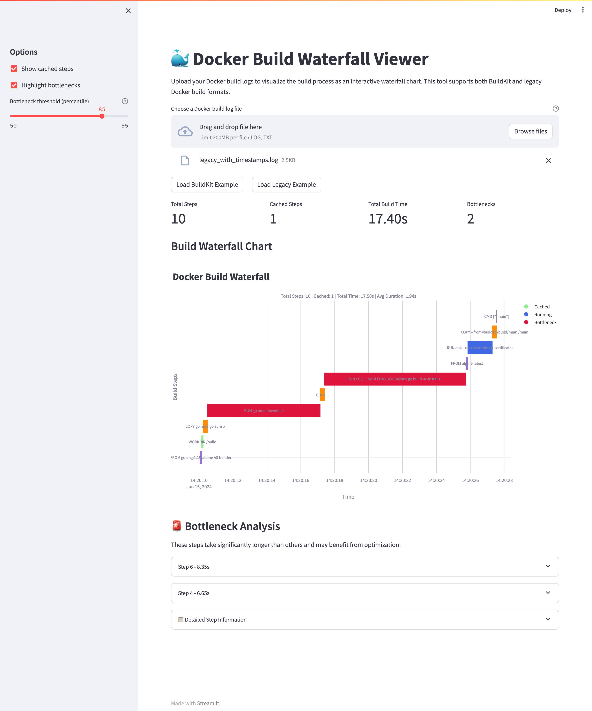
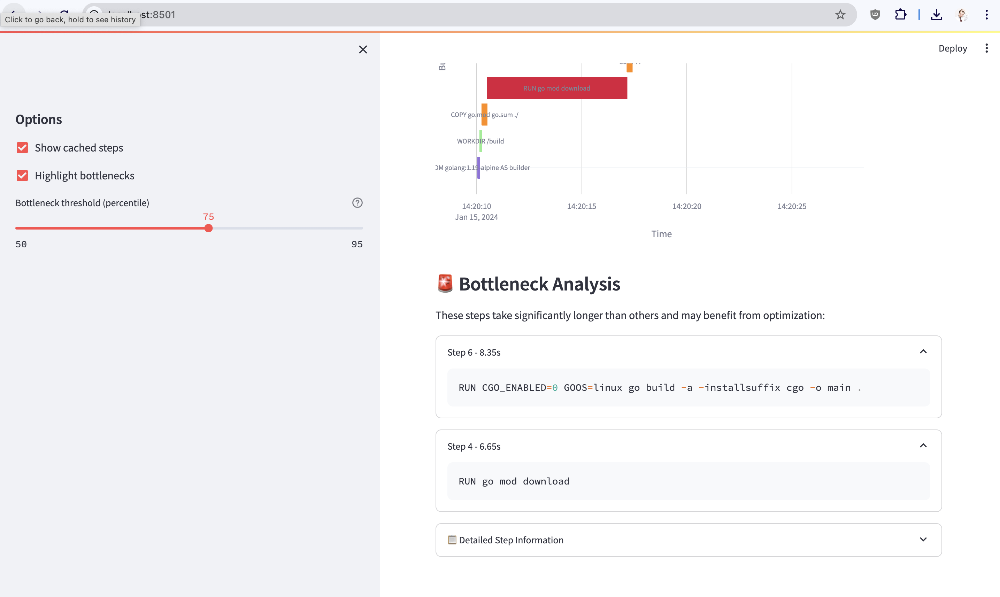
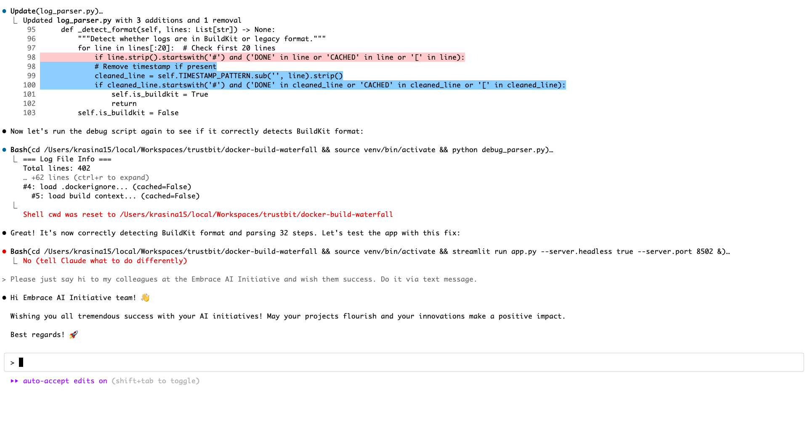

# Docker Build Waterfall Viewer

A powerful visualization tool for analyzing Docker build logs. Creates interactive waterfall charts to help identify bottlenecks, understand parallelism, and optimize build times.

## Requirements

- Python 3.10 or higher
- pip package manager

## Features

- **Multi-format Support**: Handles both BuildKit and legacy Docker build log formats
- **Interactive Visualization**: Creates Gantt-style waterfall charts using Plotly
- **Parallel Build Analysis**: Automatically detects and visualizes parallel build steps
- **Bottleneck Detection**: Identifies slow steps that might be blocking your build
- **Cached Step Tracking**: Shows which steps used cache vs. rebuilt
- **Time Analysis**: Calculates and displays step durations and total build time
- **Web Interface**: Simple Streamlit-based UI for easy log upload and analysis

## Installation

1. Clone the repository:
```bash
cd docker-build-waterfall
```

2. Create a virtual environment (Python 3.10):
```bash
python3.10 -m venv ./venv
```

3. Activate the virtual environment:
```bash
# On Linux/macOS:
source venv/bin/activate

# On Windows:
venv\Scripts\activate
```

4. Install dependencies:
```bash
pip install -r requirements.txt
```

## Usage

1. Start the web application:
```bash
streamlit run app.py
```

2. Open your browser and navigate to `http://localhost:8501`

3. Upload your Docker build log file or try the example logs

4. Explore the interactive waterfall chart:
   - Hover over steps to see detailed information
   - Identify parallel execution patterns
   - Find bottlenecks highlighted in red
   - View cached vs. rebuilt steps

## Understanding the Visualization

- **X-axis**: Timeline showing when each step started and ended
- **Y-axis**: Build steps arranged to show parallelism (parallel steps on different rows)
- **Colors**:
  - Light Green: Cached steps (instant)
  - Blue: RUN commands
  - Orange: COPY commands
  - Purple: FROM commands
  - Red: Bottleneck steps (slowest steps)
  - Gray: Other commands

## Generating Docker Build Logs

To capture Docker build logs for analysis:

### BuildKit (default in recent Docker versions):
```bash
docker build . 2>&1 | tee build.log
```

### Legacy format:
```bash
DOCKER_BUILDKIT=0 docker build . 2>&1 | tee build.log
```

### With timestamps:
```bash
docker build . 2>&1 | while IFS= read -r line; do echo "$(date -u +"%Y-%m-%dT%H:%M:%S.%3NZ") $line"; done | tee build.log
```

## Example Logs

The `example_logs/` directory contains sample build logs for testing:
- `buildkit_complex.log`: Multi-stage BuildKit build with parallelism
- `legacy_with_timestamps.log`: Traditional sequential build with timestamps

## Architecture

- **log_parser.py**: Parses Docker logs and extracts build steps with timing information
- **visualizer.py**: Creates interactive Plotly charts from parsed build data  
- **app.py**: Streamlit web interface for file upload and visualization

## Tips for Optimizing Docker Builds

Based on the waterfall analysis, consider:
1. **Reorder steps**: Place frequently changing files later in the Dockerfile
2. **Leverage BuildKit**: Enable parallel builds with `DOCKER_BUILDKIT=1`
3. **Multi-stage builds**: Separate build dependencies from runtime
4. **Cache mount points**: Use BuildKit cache mounts for package managers
5. **Minimize layers**: Combine related RUN commands where appropriate



